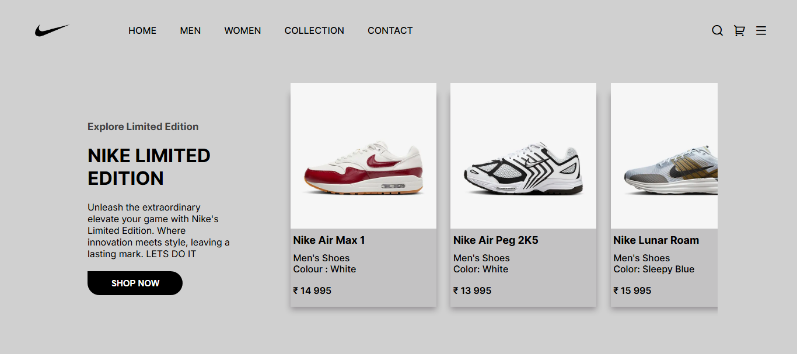

# Nike Landing Page 👟  

A simple and responsive **Nike Landing Page** built using **HTML** and **CSS**.  
This project is part of my practice journey to improve my frontend development and design skills.  

---

## 🌐 Live Demo  
🔗 **View Website:** [https://arnuuucpp.github.io/nike-landing-page/]

---

## 🖼️ Project Preview  
Here’s a quick look at the website 👇  

  
---

## 💡 Features  
- Modern landing page inspired by **Nike’s official website**  
- Responsive layout for all screen sizes  
- Custom favicon  
- Clean and minimal UI  
- Hover animations and smooth transitions  

---

## 🛠️ Tech Stack  
- **HTML5**  
- **CSS3**  
- **VS Code**  
- **GitHub Pages** (for hosting)

---

## 📁 Folder Structure  
nike-landing-page/
│
├── index.html
├── style.css
├── script.js
├── images/
│ ├── logo.png
│ ├── shoe1.png
│ ├── preview.png
│ └── (other images)
└── README.md

---

💬 About This Project

This was a learning project, inspired by Nike’s design.
I understood and implemented layout, flexbox, hover effects, and how to structure clean HTML/CSS code.

---

👤 Author

Arnav
📧 itsarnav3546@gmail.com